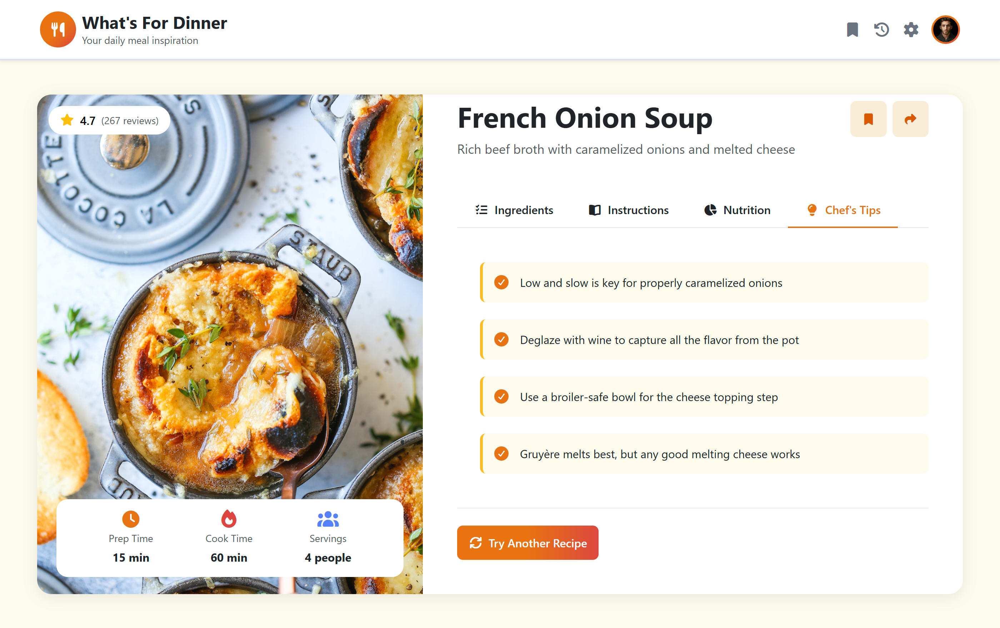

# 🍽️ What's For Dinner

A random recipe generator that helps you decide what to cook. Click **Try Another Recipe** to get a new dish, complete with ingredients, step-by-step instructions, nutrition facts, and chef's tips.

**🔗 Live Demo:** https://jamalmahran.github.io/whats-for-dinner/



## ✨ Features

- **Random recipe picker:** shows a different meal each time you click the button
- **Dynamic content:** every part of the recipe card is rendered with JavaScript from a single data source
- **Tabbed layout:** Ingredients, Instructions, Nutrition, and Chef's Tips in Bootstrap tabs
- **Recipe overview:** rating, prep time, cook time, servings, difficulty, and cuisine tags
- **Custom styling:** gradient utility classes built with CSS variables, plus custom scrollbars

## 🛠️ Built With

- HTML5
- CSS3 (custom properties, Flexbox, Grid)
- Bootstrap 5
- JavaScript (DOM manipulation, event listeners)
- Font Awesome

## ⚙️ How It Works

All recipes are stored as objects in an array inside `js/index.js`. When the page loads, or when the button is clicked, the app:

1. Picks a random recipe using `Math.random()`
2. Updates the image, title, tags, and stats in the page
3. Builds the ingredients, instructions, and tips lists with loops and template literals

To add a new recipe, just add a new object to the `meals` array.

## 🚀 Run Locally

```bash
git clone https://github.com/jamalmahran/whats-for-dinner.git
cd whats-for-dinner
```

Then open `index.html` in your browser.

## 📁 Project Structure

```
whats-for-dinner/
├── index.html
├── README.md
├── css/
│   ├── all.min.css            # Font Awesome
│   ├── bootstrap.min.css      # Bootstrap 5
│   ├── style.css              # Main styles
│   └── media.css              # Responsive styles (mobile & tablet)
├── js/
│   ├── bootstrap.bundle.min.js
│   └── index.js               # Recipe data & app logic
├── images/                    # Recipe photos
├── webfonts/                  # Font Awesome icons
└── screenshots/
    └── preview.png
```

---

Made by [Jamal Mahran](https://github.com/jamalmahran)
